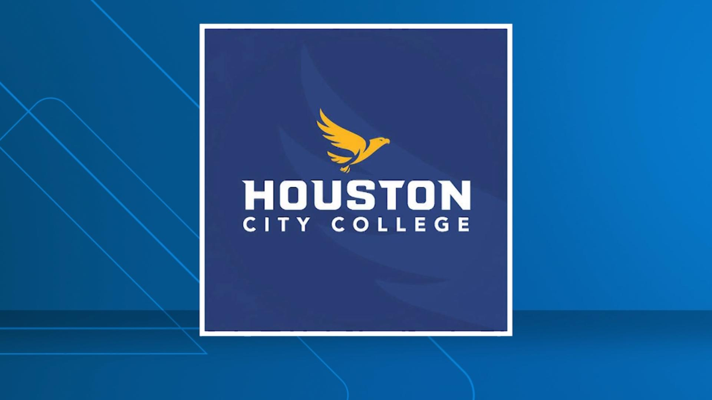

<!-- ======================================= -->
<!--        NAVY BLUE + GOLD THEME           -->
<!-- ======================================= -->

# Alicia — Cybersecurity Portfolio

---

<!-- BADGES -->

  
  
  
  

---

<!-- NAVIGATION BAR -->

  <a href="about/about-me.md">About</a> •
  <a href="education-coursework/coursework.md">Education</a> •
  <a href="skills/cybersecurity-skills.md">Skills</a> •
  <a href="projects/ncl/ncl-summary.md">Projects</a> •
  <a href="reflections/reflections.md">Reflections</a> •
  <a href="documents/README.md">Documents</a> •
  <a href="contact/contact-info.md">Contact</a>

---

<!-- ======================================= -->
<!--                LOGOS                    -->
<!-- ======================================= -->

  

---

### ⭐ Thanks for visiting my portfolio!  
  Built with Eagle pride!

